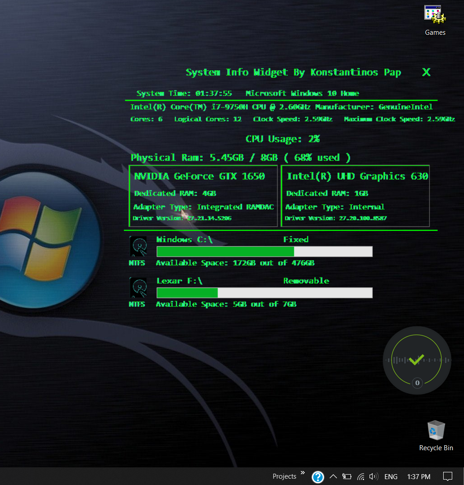

# System Info Widget

 A widget to display system information CPU usage Memory usage Disk Activity and GPU information. Plug and Play drives will also be loaded realtime and you can view their activity.
 
 This will be an Extention to Project Eve (Coming up soon) but it can be also used Standalone.
